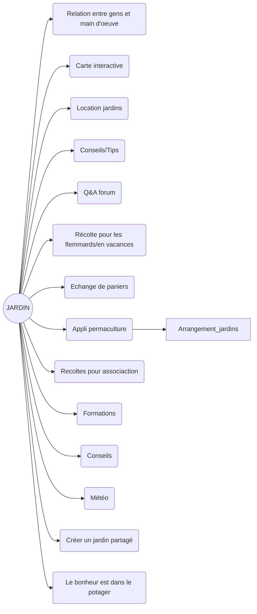

Ordre du jour:
- Brainstorm
- Définition des attendus et des fonctionnalités innovantes

**Début de la réunion 18h06:**
Tableau récapitulatif des idées :

Sélection des composantes intéressantes et innovantes, première définition exhaustive des fonctionnalités :

## LE BONHEUR EST DANS LE POTAGER (titre provisoire)

 Gestionnaire de jardin partagé 

- Gestion des parcelles :
	↪ Admin
	↪ Users $\rightarrow$ Chacun leur parcelle
- Pour chaque parcelle :
	1 - Choix 
		↪Légumes
		↪Fruits
		↪Herbes aromatiques
	2 - Suggestions permacultures

>[!TIP] Ajouts possibles (si le temps le permet)
> - Météo (API Météo France)
> - Wiki
> - Forum de discussion
> - Carte interactive

Fin de réunion 18h45